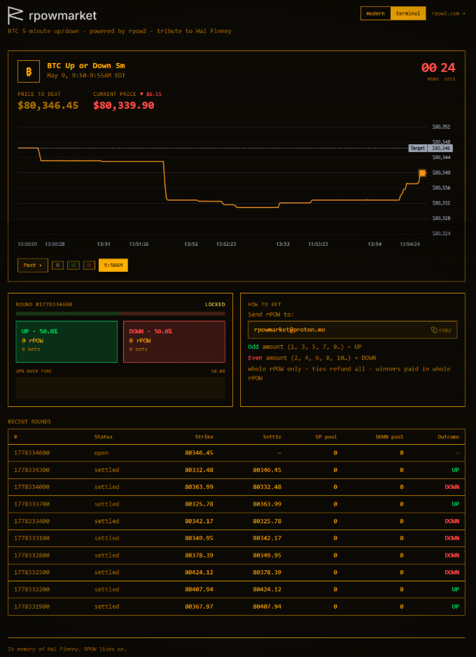
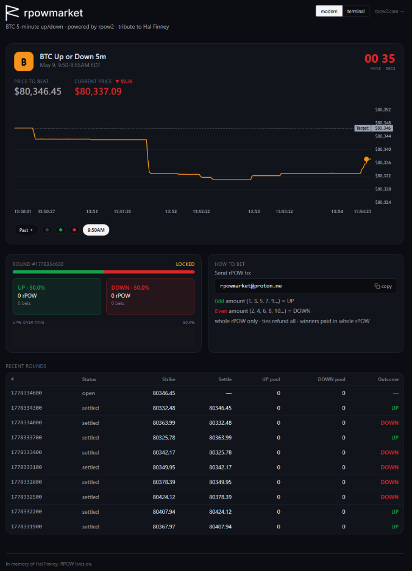

<div align="center">


# rpowMarket — BTC Up / Down Prediction Market on rpow2, rpow3, rpow4!

**Open-source 5-minute Bitcoin price market. Polymarket-style parimutuel pools.
Built on [rpow2](https://rpow2.com) play tokens. Tribute to Hal Finney.**

[](#disclaimer)
[](https://nextjs.org)
[](https://www.typescriptlang.org)
[](https://www.sqlite.org)
[](#license)

[live demo](https://github.com/ImMike/rpowmarket) · [rpow2.com](https://rpow2.com) · [@dotkrueger](https://x.com/dotkrueger) · [Hal Finney](https://nakamotoinstitute.org/rpow/)

</div>

---

<p align="center">
  
  <br/><sub><b>Modern theme</b> — live BTC price, dashed strike, pulsing tip, UP/DOWN parimutuel pools.</sub>
</p>

<p align="center">
  
  <br/><sub><b>Terminal theme</b> — amber CRT scanlines for the rpow purists. Toggle in the top-right.</sub>
</p>

---

## ▮ TL;DR

Send rPOW to the banker.
**Odd amount → UP. Even amount → DOWN.** That's the whole UX.
BTC price decides the round. Winners get paid back to their inbox, automatically.
Zero fees. Zero account. Zero monetary value. **Maximum vibes.**

```
   you                       banker (rpow2 wallet)              chain (BTC/USD)
    │                              │                                  │
    │   send  1 rPOW (odd → UP)    │                                  │
    │ ───────────────────────────► │                                  │
    │                              │                                  │
    │                              │           5 min later…           │
    │                              │ ◄────────  settle: 80,237 ──────│
    │                              │           strike: 80,230 → UP    │
    │                              │                                  │
    │   payout: stake + share of   │                                  │
    │ ◄─── losing pool, pro-rata   │                                  │
```

## ▮ Table of contents

- [What is this?](#-what-is-this)
- [How it works](#-how-it-works)
- [Architecture](#-architecture)
- [Run it locally](#-run-it-locally)
- [Configuration](#-configuration)
- [Safety properties](#-safety-properties)
- [Roadmap](#-roadmap)
- [Credits](#-credits)
- [Disclaimer](#-disclaimer)

## ▮ What is this?

rpowMarket is a **parody Polymarket** for play money — specifically, [@dotkrueger](https://x.com/dotkrueger)'s [rpow2](https://rpow2.com) tokens, themselves a centralized tribute to Hal Finney's original Reusable Proofs of Work (the first cryptographic money based on proof-of-work, four years before Bitcoin).

When rpow2 went from 33 users to 30,000 in 26 hours, it deserved a Polymarket-shaped dance partner. So here it is: a 5-minute BTC up/down market that runs on top of rpow2's send/receive primitives, with no order book, no signup, no KYC, and no real money — because **rPOW has zero monetary value**.

Built for fun. Open source. Fork it, mock it, re-skin it, run your own.

> [!IMPORTANT]
> **This is a parody. rPOW has no value. Nothing is at stake.** Read the [disclaimer](#-disclaimer).

## ▮ How it works

### Prediction by sending rPOW. Side encoded in the amount.

| Last non-zero digit of `amount_base_units` | Side | Examples |
|---|---|---|
| **odd** (1, 3, 5, 7, 9) | 🟢 **UP** | `1`, `3`, `11`, `0.005`, `0.001247` |
| **even** (0 doesn't count, 2, 4, 6, 8) | 🔴 **DOWN** | `2`, `4`, `12`, `0.006`, `0.000128` |

No amount is too small. No account exists. No order book. The transfer **is** the prediction.

### Round mechanics

```
┌──────────── 5-minute round, wall-clock aligned ────────────┐
│                                                            │
│   T+0:00 ─────── T+4:00 ──────────────── T+5:00            │
│   strike         lockout begins          settle + payout   │
│   snapshotted    (anti-snipe, 1 min)     pool distributes  │
│                                                            │
└────────────────────────────────────────────────────────────┘
```

- **Strike** = BTC/USD at round start (Coinbase 1-min kline, Kraken fallback)
- **Settle** = BTC/USD at round end, **cross-checked** Coinbase ↔ Kraken — if they disagree by >0.5%, the **whole round refunds**
- **Tie** (settle == strike) → full refund
- **Late predictions** (after lockout) → full refund

### Payouts

- Stake + pro-rata share of the losing pool, minus configurable rake (default `0%`)
- **Atomic claim** prevents double-payouts under multi-worker concurrency
- **Stable idempotency keys** dedupe at the rpow2 API too
- **Exponential backoff** retries (5s → 30s → 5m → 30m → 2h)
- If a payout permanently fails (denomination mismatch on banker's side), the system queues an automatic **stake refund** — worst case, you get your prediction back

## ▮ Architecture

```
            ┌──────────────────────────────┐
            │     rpow2.com /activity      │  ← predictions land as token receives
            └──────────────┬───────────────┘
                           │ poll 5s · cookie auth · watermarked
                           ▼
   ┌────────────────────────────────────────────────────┐
   │       worker (tsx) — single-writer settler         │
   │   • ingest  → predictions table (dedup by tx_key)         │
   │   • snapshot strike (Coinbase / Kraken fallback)   │
   │   • settle  → atomic UPDATE WHERE status=open      │
   │   • payout  → idempotent rpow2 /send + retry       │
   │   • dead-payout → auto stake refund                │
   │   • sample BTC every tick → prices table           │
   │   • heartbeat → /api/health                        │
   └────────────────────────┬───────────────────────────┘
                            │
                       ┌────┴─────┐
                       │  SQLite  │  (WAL · Postgres-ready)
                       └────┬─────┘
                            │
   ┌────────────────────────┴────────────────────────┐
   │              Next.js 15 (app router)            │
   │  /api/state          → cached snapshot (1s TTL) │
   │  /api/state/stream   → SSE state push           │
   │  /api/btc/stream     → fan-out Coinbase ticker  │
   │  /api/prices?round=  → server-side chart history│
   │  /api/health         → heartbeat + queue depth  │
   └────────────────────────┬────────────────────────┘
                            │
                            ▼
        browser · React · lightweight-charts · Tailwind
                  modern theme  /  terminal theme
```

## ▮ Run it locally

```bash
git clone https://github.com/ImMike/rpowmarket.git
cd rpowmarket
npm install
cp .env.example .env
# edit .env: set BANKER_EMAIL + RPOW_SESSION_COOKIE (grab from your browser
# DevTools after logging in to rpow2.com as the banker)
```

```bash
# two terminals:
npm run dev      # web at http://localhost:3000
npm run worker   # ticker · settler · payout sender
```

Open `http://localhost:3000`, toggle the theme top-right, watch a round settle live. Hit `/api/health` for ops status.

## ▮ Configuration

| Env var | Default | What |
|---|---|---|
| `BANKER_EMAIL` | _required_ | rpow2 account that receives predictions and sends payouts |
| `RPOW_SESSION_COOKIE` | _required_ | `rpow_session=…` from browser DevTools (banker logged-in) |
| `RPOW_API_TOKEN` | — | alt auth if rpow2 ever ships long-lived tokens |
| `RAKE_BPS` | `0` | bps cut from losing pool kept by house (`200` = 2%) |
| `ROUND_SECONDS` | `300` | length of each round |
| `ACCEPT_SECONDS` | `240` | accept window before lockout |
| `MIN_BET_BASE` | `1` | minimum prediction in base units (10⁻⁹ rPOW) |
| `MAX_BET_RPOW` | `1000` | whale guard per single transfer |
| `MAX_CLOCK_SKEW_MS` | `300000` | reject predictions timestamped impossibly in the future |
| `DB_PATH` | `./data/market.db` | SQLite location |

## ▮ Safety properties

```
  ┌─────────────────────────────────────────────────────────────────┐
  │  ✓  atomic settle claim     UPDATE WHERE status IN (open|locked)│
  │  ✓  atomic payout claim     UPDATE WHERE status='pending'       │
  │  ✓  idempotent /send key    rpowmarket-payout-${id}             │
  │  ✓  exp-backoff retries     5s · 30s · 5m · 30m · 2h            │
  │  ✓  dead-payout fallback    auto stake refund on perma-fail     │
  │  ✓  oracle cross-check      Coinbase ↔ Kraken; >0.5% → refund   │
  │  ✓  ingest watermark        pre-launch activity ignored         │
  │  ✓  clock-skew sanity       future-dated predictions dropped           │
  │  ✓  prediction bounds              min/max per transfer                │
  │  ✓  email masking           PII never leaves the server         │
  │  ✓  HTTP cache + SSE        CDN-friendly · 30k-user-ready       │
  │  ✓  ws fan-out              one upstream → many SSE clients     │
  └─────────────────────────────────────────────────────────────────┘
```

## ▮ Roadmap

**Shipped:**

- [x] Atomic settle / payout claims, no race double-pay
- [x] Coinbase + Kraken cross-checked oracle, auto-refund on disagreement
- [x] Min/max prediction, clock-skew sanity, dust drop, email masking server-side
- [x] Exponential backoff payout retries; permanent failures → auto stake refund
- [x] SSE state stream, fan-out BTC ticker, server-side chart backfill
- [x] HTTP cache + `Cache-Control` for CDN reads
- [x] `/api/health` heartbeat
- [x] Modern + terminal CRT themes

**On the bench (Phase C):**

- [ ] Postgres swap-in (SQLite handles current scale fine)
- [ ] Multi-worker leader election via advisory lock
- [ ] Public audit log (every settlement, every transfer_id, verifiable)
- [ ] Admin dashboard (banker balance, denomination breakdown, alerts)
- [ ] AWS deploy templates (ECS / RDS)

See [tasks/todo.md](tasks/todo.md) for the full hardening plan.

## ▮ Credits

- **Hal Finney** — invented [Reusable Proofs of Work (RPOW)](https://nakamotoinstitute.org/rpow/) in 2004, four years before Bitcoin existed. Received the first bitcoin transaction from Satoshi.
- **[@dotkrueger](https://x.com/dotkrueger)** — built [rpow2.com](https://rpow2.com), the modern centralized tribute and the token system this market runs on.
- **Polymarket** — the UX archetype this parody bows to.
- Stack: [Next.js](https://nextjs.org), [TypeScript](https://www.typescriptlang.org), [lightweight-charts](https://www.tradingview.com/lightweight-charts/), [better-sqlite3](https://github.com/WiseLibs/better-sqlite3), [Tailwind](https://tailwindcss.com).

## ▮ Disclaimer

**rpowMarket is a parody for fun. It is not a financial product.**

- rPOW has **no monetary value**. It cannot be exchanged for cash, crypto, or anything of value.
- Nothing here constitutes gambling, investment, securities, or any regulated activity.
- Not affiliated with Polymarket, Coinbase, Kraken, Bitcoin, or the Hal Finney estate.
- Provided AS-IS with no warranties. Use at your own risk.

Long-form lawyered version inside the app at `/disclaimer`.

## ▮ License

MIT. Fork it, ship it, mock it, embed it, sell it, ignore it. Just don't sue the author.

---

<div align="center">

```
                     ──────────────────────────────────
                       in memory of  · hal finney ·
                            rpow lives on.
                     ──────────────────────────────────
```

**Keywords:** bitcoin prediction market · BTC up down · parimutuel · polymarket clone · polymarket alternative · open source prediction market · 5-minute bitcoin · rpow · reusable proof of work · hal finney · bitcoin price market · btc parimutuel · play tokens · crypto parody

</div>
